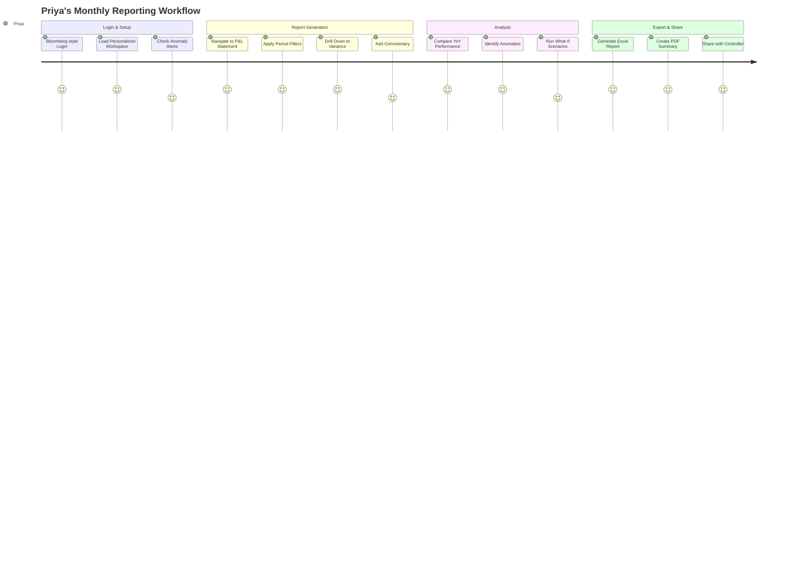
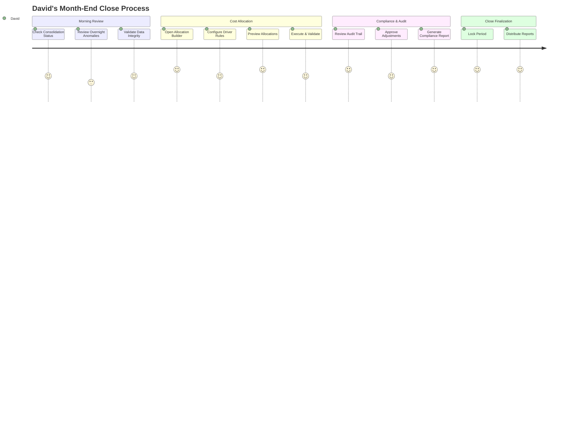
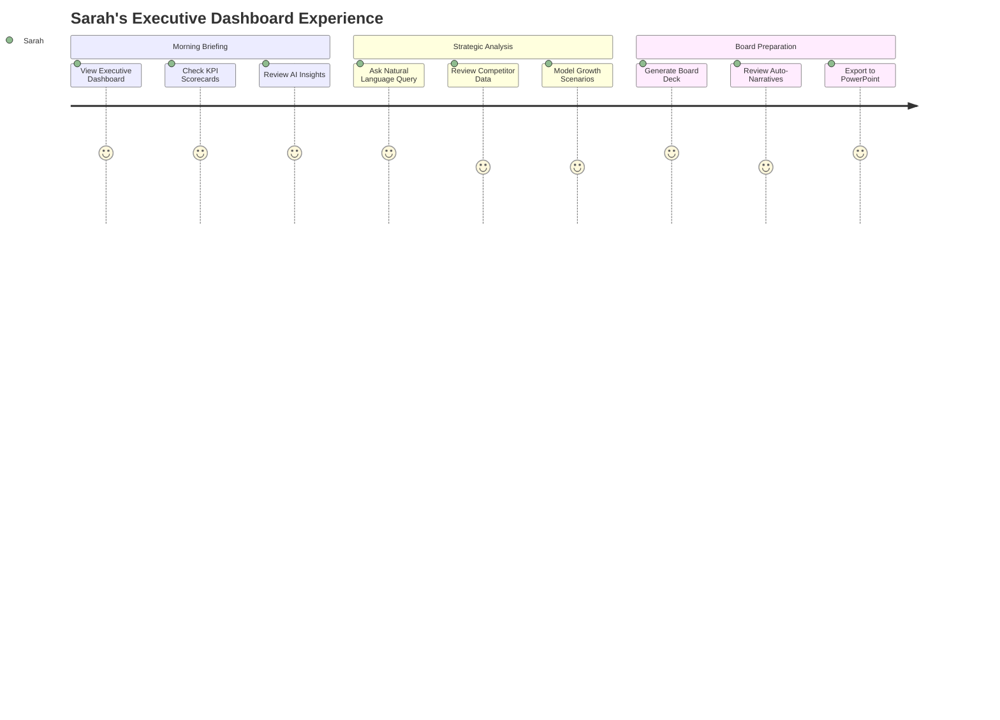
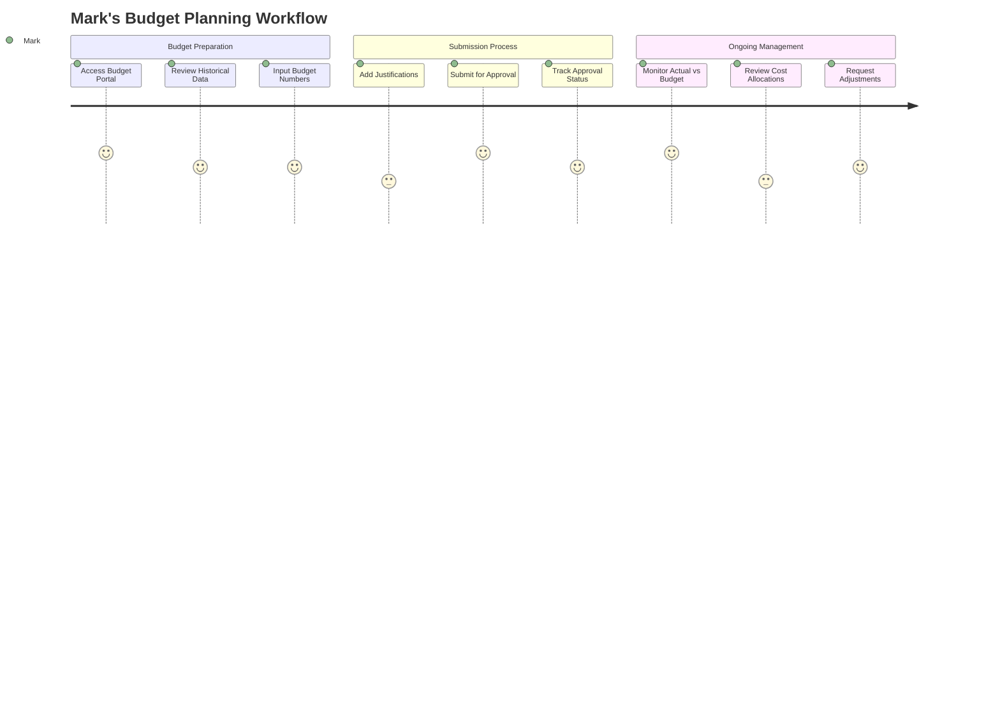

# User Journey Documentation: Orion Mockup
## Bloomberg-Style Financial Platform Workflows

---

## 1. Priya - Finance Analyst Journey

### Primary Flow: Monthly Financial Analysis



### Key Interactions:
1. **Quick Login** (0-10 sec)
   - Single sign-on with role detection
   - Auto-load last workspace configuration
   - Display pending tasks in notification panel

2. **Financial Statement Navigation** (10-30 sec)
   - Keyboard shortcut: `Cmd+P` for P&L
   - Multi-tab view for simultaneous reports
   - Sticky headers for large datasets

3. **Drill-Down Analysis** (30-60 sec)
   - Click any line item to expand
   - Breadcrumb trail: `P&L > Revenue > Product A > Q3 2024`
   - Transaction-level detail with audit trail

4. **Variance Investigation** (1-2 min)
   - AI-powered anomaly highlights in amber
   - Auto-generated variance explanations
   - Side-by-side period comparison

5. **Export Workflow** (2-3 min)
   - One-click Excel with formatting preserved
   - PDF with executive summary
   - Email integration with distribution lists

### Bloomberg Features Used:
- **SPLC** (Split Screen): Compare multiple periods
- **MAV** (Moving Average): Trend analysis
- **ALRT**: Anomaly notifications
- **XLS**: Excel integration

---

## 2. David - Financial Controller Journey

### Primary Flow: Month-End Close & Cost Allocation



### Key Interactions:
1. **Consolidation Dashboard** (0-30 sec)
   - Real-time status indicators (green/amber/red)
   - Department submission tracker
   - Critical path timeline

2. **Cost Allocation Configuration** (2-5 min)
   - Visual flow builder with drag-drop
   - Driver selection from dropdown
   - Multi-step allocation preview
   - What-if allocation testing

3. **Audit & Compliance** (5-10 min)
   - Complete change log with timestamps
   - User activity tracking
   - Approval workflow visualization
   - SOX compliance checklist

4. **Period Close** (10-15 min)
   - One-click period lock
   - Automated report distribution
   - Email notifications to stakeholders

### Bloomberg Features Used:
- **RULES**: Allocation rule engine
- **AUDIT**: Compliance tracking
- **WORK**: Workflow management
- **DIST**: Report distribution

---

## 3. Sarah - CFO Journey

### Primary Flow: Strategic Decision Making



### Key Interactions:
1. **Executive Dashboard** (0-30 sec)
   - KPI traffic lights (green/yellow/red)
   - Trend sparklines for key metrics
   - AI-generated executive summary
   - Market comparison widgets

2. **Natural Language Interface** (30 sec - 1 min)
   - Voice or text input: "What drove Q3 revenue growth?"
   - Instant visualization of results
   - Confidence scores on predictions
   - Related query suggestions

3. **Scenario Modeling** (2-5 min)
   - Slider controls for key drivers
   - Real-time P&L impact visualization
   - Sensitivity analysis matrix
   - Save/compare multiple scenarios

4. **Board Deck Generation** (5-10 min)
   - Auto-populate standard slides
   - Customizable templates
   - One-click PowerPoint export
   - Version control with changelog

### Bloomberg Features Used:
- **PORT**: Portfolio overview
- **MODL**: Scenario modeling
- **NEWS**: External intelligence
- **PRES**: Presentation builder

---

## 4. Mark - Department Head Journey

### Primary Flow: Budget Management



### Key Interactions:
1. **Budget Portal Access** (0-30 sec)
   - Simplified interface for non-finance users
   - Pre-populated with last year's data
   - Guided input with tooltips
   - Mobile-responsive design

2. **Budget Input** (5-10 min)
   - Excel-like grid for familiar UX
   - Auto-calculation of totals
   - Validation warnings for outliers
   - Comments on line items

3. **Approval Tracking** (1-2 min)
   - Visual workflow status
   - Email notifications on updates
   - Direct messaging to finance team
   - Revision history

4. **Performance Monitoring** (2-5 min)
   - Simple variance charts
   - Drill-down to transaction detail
   - Cost allocation transparency
   - Spending alerts

### Bloomberg Features Used:
- **BUDG**: Budget management
- **ALLC**: Allocation visibility
- **PERF**: Performance tracking
- **MOBL**: Mobile interface

---

## 5. Cross-Functional User Flows

### A. AI-Powered Insights Flow

```
User Input → Natural Language Processing → Query Analysis → 
Data Retrieval → Visualization Generation → Insight Delivery
```

**Steps:**
1. User types/speaks query in command bar
2. AI interprets intent and parameters
3. System fetches relevant data
4. Auto-generates appropriate chart type
5. Displays result with confidence score
6. Offers related queries and drill-downs

### B. Collaborative Planning Flow

```
Draft Creation → Team Review → Comments/Feedback → 
Revision → Approval Chain → Final Lock → Distribution
```

**Steps:**
1. Initiator creates budget/forecast draft
2. System notifies reviewers
3. Collaborative editing with presence indicators
4. Track changes and version control
5. Sequential approval workflow
6. Automatic distribution upon completion

### C. Real-Time Anomaly Response Flow

```
Data Ingestion → Pattern Analysis → Anomaly Detection → 
Alert Generation → User Notification → Investigation → Resolution
```

**Steps:**
1. Continuous data monitoring
2. AI identifies unusual patterns
3. Severity-based alert creation
4. Push notification to relevant users
5. One-click navigation to issue
6. Resolution tracking and documentation

---

## 6. Mobile User Journeys

### Responsive Touch Interactions

**Executive Mobile View (Sarah):**
- Swipe between KPI cards
- Pinch to zoom on charts
- Touch-hold for detailed tooltips
- Pull-down to refresh data

**Budget Mobile Entry (Mark):**
- Simplified form layout
- Number pad for data entry
- Swipe to navigate sections
- Touch ID for approval

**Alert Management (All Users):**
- Push notifications for critical alerts
- Swipe actions (dismiss/investigate)
- Quick response options
- Offline queue for actions

---

## 7. Accessibility Journeys

### Keyboard-Only Navigation

**Complete workflow without mouse:**
1. `Tab` - Navigate between elements
2. `Enter` - Select/expand items
3. `Arrow keys` - Move within tables
4. `Cmd+/` - Open command palette
5. `Esc` - Close modals/panels
6. `F1` - Context-sensitive help

### Screen Reader Support

**Semantic HTML structure:**
- Proper heading hierarchy
- ARIA labels for icons
- Alt text for charts
- Table summaries
- Focus announcements

---

## 8. Demo Script Sequences

### Quick Demo (5 minutes)

1. **0:00-0:30** - Login and Dashboard
2. **0:30-1:30** - Financial Report Drill-down
3. **1:30-2:30** - AI Natural Language Query
4. **2:30-3:30** - Cost Allocation Builder
5. **3:30-4:30** - Budget Workflow
6. **4:30-5:00** - Export and Mobile View

### Detailed Demo (15 minutes)

1. **0:00-1:00** - Bloomberg-style Interface Tour
2. **1:00-3:00** - Priya's Analysis Workflow
3. **3:00-5:00** - David's Cost Allocation
4. **5:00-7:00** - Sarah's Executive Dashboard
5. **7:00-9:00** - Mark's Budget Submission
6. **9:00-11:00** - AI Assistant Capabilities
7. **11:00-13:00** - Scenario Modeling
8. **13:00-14:00** - Collaboration Features
9. **14:00-15:00** - Mobile and Accessibility

---

## 9. Error Handling & Edge Cases

### Common Error Scenarios

**Data Loading Failures:**
- Show skeleton loaders
- Display cached data with timestamp
- Offer retry option
- Provide offline mode

**Validation Errors:**
- Inline error messages
- Field highlighting
- Suggested corrections
- Help documentation links

**Permission Denied:**
- Clear error messaging
- Request access workflow
- Alternative data view
- Contact admin option

---

## 10. Performance Expectations

### User-Perceived Performance

| Action | Target Time | Bloomberg Standard |
|--------|------------|-------------------|
| Login | < 2 sec | < 1 sec |
| Page Load | < 1 sec | < 500ms |
| Report Generation | < 3 sec | < 2 sec |
| Chart Update | < 500ms | < 300ms |
| Search Results | < 1 sec | < 500ms |
| Export Generation | < 5 sec | < 3 sec |

### Interaction Feedback

- **Immediate** (< 100ms): Hover states, focus indicators
- **Fast** (< 300ms): Menu opens, tab switches
- **Responsive** (< 1 sec): Data loads, calculations
- **Background** (> 1 sec): Progress indicators shown

---

*This user journey documentation provides comprehensive workflows for all personas, ensuring the Orion mockup demonstrates professional, Bloomberg-quality interactions that will resonate with stakeholders during presentations.*